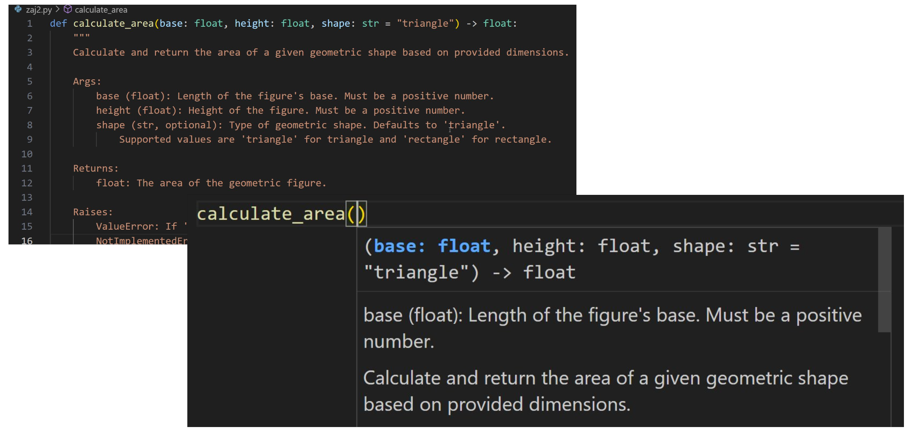

Jest to kluczowy element tworzenia czytelnego i dobrze utrzymanego kodu. Odpowiednia dokumentacja nie tylko ułatwia współpracę z innymi programistami, ale również pomaga nam wrócić do kodu po czasie. W Pythonie dokumentacja klas i funkcji odbywa się głównie przy użyciu **docstringów**, które stanowią tekstową informację o celu i sposobie działania kodu.

## Docstring
**Docstring** to tekst pomiędzy potrójnymi cudzysłowami (`"""`) lub apostrofami (`'''`), który umieszczamy zaraz po definicji klasy, funkcji lub modułu. Docstring jest dostępny za pomocą specjalnego atrybutu `.__doc__` i może być przetwarzany przez narzędzia dokumentacyjne (np. Sphinx, PyDoc).

Popularne są różne style dokumentacji docstring, np. w standardzie PEP 257, Google Style czy Numpydoc Style.

???- "Przykład dokumentacji funkcji z użyciem Google Docstring Style"

    ```python
    def calculate_area(length, width):
        """
        Calculate the area of a rectangle.
    
        Args:
            length (float): The length of the rectangle.
            width (float): The width of the rectangle.
    
        Returns:
            float: The calculated area of the rectangle.
        
        Raises:
            ValueError: If length or width is negative.
        """
        if length < 0 or width < 0:
            raise ValueError("Length and width must be non-negative.")
        return length * width
    ```

???- "Przykład dokumentacji klasy z użyciem Google Docstring Style"

    ```python
    class Rectangle:
        """
        A class to represent a rectangle shape.
    
        Attributes:
            length (float): The length of the rectangle.
            width (float): The width of the rectangle.
    
        Methods:
            area(): Calculates the area of the rectangle.
            perimeter(): Calculates the perimeter of the rectangle.
        """
    
        def __init__(self, length, width):
            """
            Initialize a new rectangle instance.
    
            Args:
                length (float): The length of the rectangle.
                width (float): The width of the rectangle.
            """
            self.length = length
            self.width = width
    
        def area(self):
            """
            Calculate the area of the rectangle.
    
            Returns:
                float: The area of the rectangle.
            """
            return self.length * self.width
    
        def perimeter(self):
            """
            Calculate the perimeter of the rectangle.
    
            Returns:
                float: The perimeter of the rectangle.
            """
            return 2 * (self.length + self.width)
    ```

## Wykorzystanie dokumentacji przez nowoczesne IDE

IDE (ang. *Integrated Development Environment*) - Zintegrowane Środowisko Programistyczne, czyli Pycharm czy Visual Studio Code.

IDE potrafią automatycznie odczytywać docstringi i udostępniać je użytkownikowi podczas pisania kodu. Dzięki temu, gdy tylko zaczynamy korzystać z funkcji lub klasy, IDE wyświetla podpowiedzi o dostępnych argumentach, typach danych, zwracanych wartościach, a także szczegóły dotyczące wyjątków, które mogą zostać zgłoszone. Docstringi dostarczają również szczegółowych informacji w panelach dokumentacji lub poprzez `hover` (najechanie myszą na nazwę funkcji lub klasy), co znacząco przyspiesza pracę i pozwala lepiej zrozumieć działanie kodu bez konieczności przeglądania całej jego implementacji.



### Zadania

1. Dodaj dokumentację dla wybranej przez siebie funkcji.